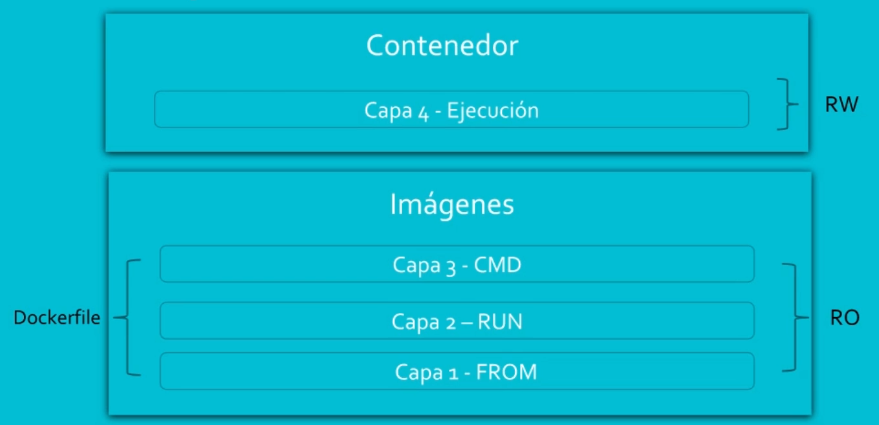
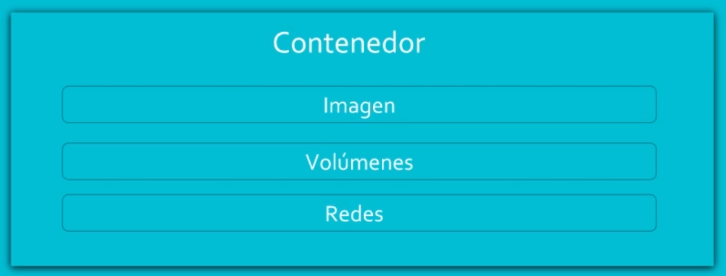
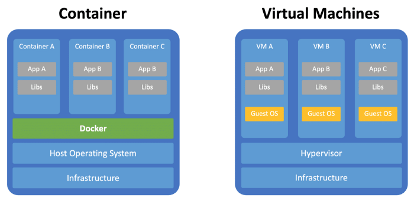

# docker-notes

Notas de docker del curso  - https://www.udemy.com/course/docker-de-principiante-a-experto/

## Que es docker

Es una herramienta que permite desplegar aplicaciones en contenedores, de forma rapida y portable.

Es capaz de generar aplicaciones de bolsillo, (imagen : defines toda la configuracion software y librerias que necesita la aplicacion , contenedores: Es una instancia de las imagenes osea volverlo real)

Perimite desplegar y escalar aplicaciones, tambien las podemos destruir y recrear sin problemas.


### **Ejemplo de creacion de un contenedores** :

```bash
# creacion de un container
docker run -d -p 80:80 --name web httpd

# eliminacion del container
docker rm -fv web
```

```bash
# creacion de un container
docker run -d -p 81:80 --name web2 nginx

# eliminacion del container
docker rm -fv web2
```

## Arquitectura de docker

- **Docker Host** : Servidor donde se aloja el servicio de docker
- **Docker Deamon** - Server : Es un servicio
- **Rest AP**I : es el canal de comunicacion entre docker server y docker client
- **Docker CLI** - Cliente : Es el cliente de administracion de docker

Con el docker client podemos manejar:

- Imagenes
- Contenedor
- Volumenes
- Redes


## Imagenes

Es un paquete que aborda y contiene toda la configuracion necesaria para que funcione el servicio. las imagenes vienen con diferentes capas (podemos tener muchas capaz)

- **Capa 1 - From** : Definimos el sistema operativo
- **Capa 2 - RUN** : Instalacion
- **Capa 3 - CMD** :  Linea que se va a ejecutar 

las capas son de solo lectura en la imagen

**Dockerfile** : Archivo donde se definen las capas

Dockerfile
```
FROM centos:7
RUN yum -y install httpd
CMD ["apachectl","-DFOREGROUND"]
```


## Contenedores

El contenedor es una capa 4, que permite la ejecucion de las capas de la imagen, es una instancia en ejecucion de la imagen, se pueden tener diferentes contenedores de una misma imagen. Si es una capa de escritura. Todos los cambios realizados en esta capa, seran temporales.

No es recomendable configurar cosas en la capa 4. Configuracion persistente se debe poner en la imagen



- Imagen en ejecucion 
- Volumenes (data persistente)
- redes (lograr comunicar contenedores entre si)



## Contenedores VS Maquina virtuales





